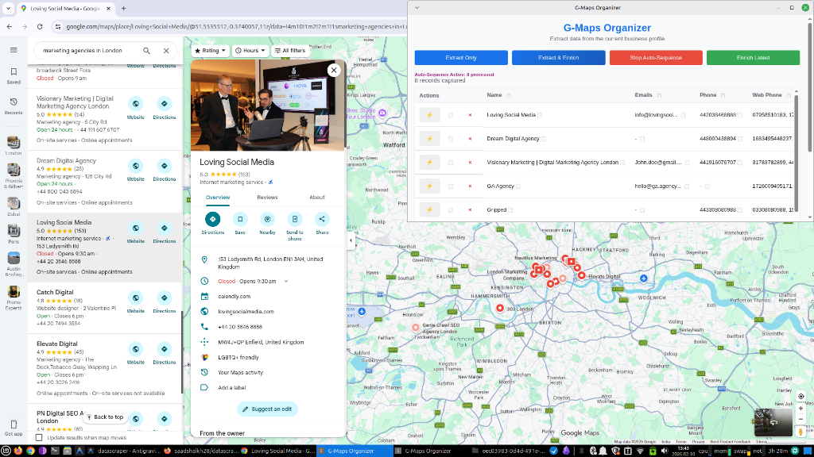

# 📍 G-Maps Organizer

### *The Ultimate Google Maps Business Data Research Tool*

**G-Maps Organizer** is a high-performance, lightweight Chrome Extension designed for lead generation, market research, and sales prospecting. It streamlines the process of extracting, organizing, and enriching business data directly from Google Maps into a clean, actionable format.

---

## 🚀 Key Features

- **⚡ Instant Extraction**: Capture business names, categories, addresses, phones, and websites with a single click.
- **🔍 Deep Enrichment**: Automatically fetch emails, social media profiles, and more directly from business websites.
- **🔄 Auto-Sequence**: Automate the extraction process across multiple business profiles to build your lead lists faster.
- **📊 Professional Export**: Export your data to **CSV** or **XLSX** (Excel) format, perfectly formatted for Google Sheets or CRMs.
- **📋 Smart Copy**: 
  - Copy individual cells.
  - Copy entire columns (perfect for email/phone lists).
  - Copy full rows optimized for spreadsheet pasting.
- **🖥️ Detached Interface**: Operates in a standalone window, allowing you to research on one screen and manage data on another.

---

## 🛠️ How to Use

1. **Start Research**: Open Google Maps and search for any business category (e.g., "Marketing Agencies in London").
2. **Launch Extension**: Click the **G-Maps Organizer** icon. A standalone window will appear.
3. **Capture Data**:
   - Click **Extract Only** for basic details.
   - Click **Extract & Enrich** to also find emails and socials.
   - Use **Start Auto-Sequence** to process results sequentially without manual clicks.
4. **Manage & Export**: Review your captured records in the table, then use the export buttons to save your CSV or XLSX file.

---

## 📥 Installation (Developer Mode)

1. **Clone/Download** this repository to your local machine.
2. **Open Chrome** and navigate to `chrome://extensions/`.
3. **Enable "Developer Mode"** in the top-right corner.
4. Click **"Load unpacked"** and select the folder containing these files.
5. Pin the extension to your toolbar for easy access.

> [!IMPORTANT]
> **Dependencies**: For XLSX export functionality, ensure you have the library saved at `libs/xlsx.full.min.js`. (Link: [xlsx.full.min.js](https://cdnjs.cloudflare.com/ajax/libs/xlsx/0.18.5/xlsx.full.min.js))

---

## 📋 Data Points Captured

| Feature | Fields Extracted |
| :--- | :--- |
| **Core Info** | Business Name, Category, Street Address |
| **Contact** | Phone Number (Formatted), Website URL |
| **Performance** | Rating, Total Review Count |
| **Operational** | Opening Hours |
| **Enriched** | Emails, LinkedIn, Twitter, Facebook, Instagram |

---

## ⚖️ Disclaimer

This tool is strictly for **personal research and lead generation purposes**. It does not perform automated scraping of Google Maps servers and must be used in accordance with Google's Terms of Service. Data is stored locally in your browser and never sent to any external servers.

---
*Created by [Saad Shaikh](https://github.com/saadshaikh28)*
